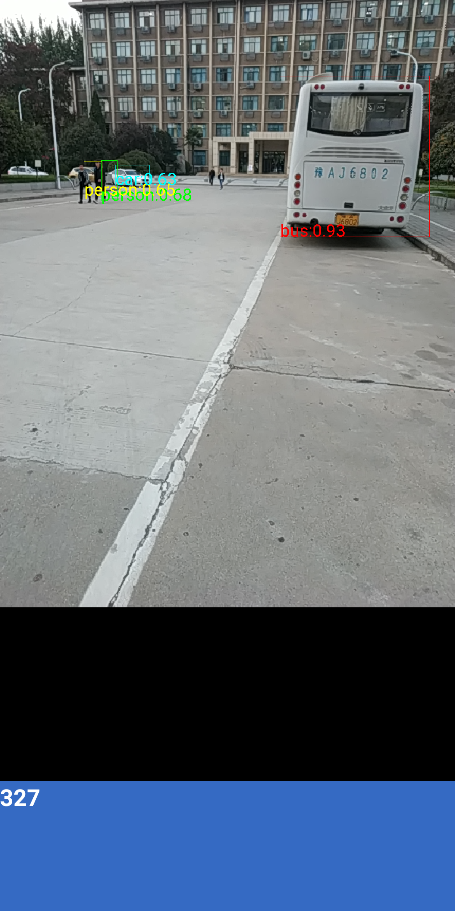

# Android-Objectdetection
This project could serve to a simple way to complish detect, but honestly not very efficient! Since I just implement one fragment to resolve all problems. However, it can be a good helper to understand the mechanism of detection.

  

  

# Reference
I heavily borrow code from those projects. 
All of them give me great inspiration and knowledge 
First of all I basically work on google example [android-Camera2Basic](https://github.com/googlesamples/android-Camera2Basic) 
then Tensorflow could not be omitted [Tensorflow](https://github.com/tensorflow/tensorflow/tree/master/tensorflow/examples/android) 
Thanks to [szaza](https://github.com/szaza),I was suddenly enlightened. [android-yolo-v2](https://github.com/szaza/android-yolo-v2)

# Finally
For me,logging that punctual a code block helps me more than that debug does.
